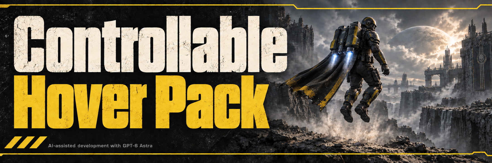

# Controllable Hover Pack

Press Space again during hover-pack flight to descend early while preserving the pack's native landing assistance.

| Vanilla | With this mod |
| --- | --- |
| Hover flight runs until its automatic cutoff; pressing Space again does not end it. | Release Space after takeoff, then press it again to begin descending when you choose. |
| The pack automatically slows your descent near the ground. | The same native landing assistance remains active when you end a flight early. |

Holding the initial activation press does not cancel the flight. If you have rebound the Jump Pack action, use that binding instead of Space. The next flight retains its normal duration.
